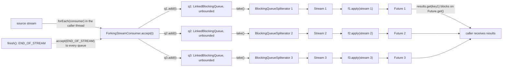
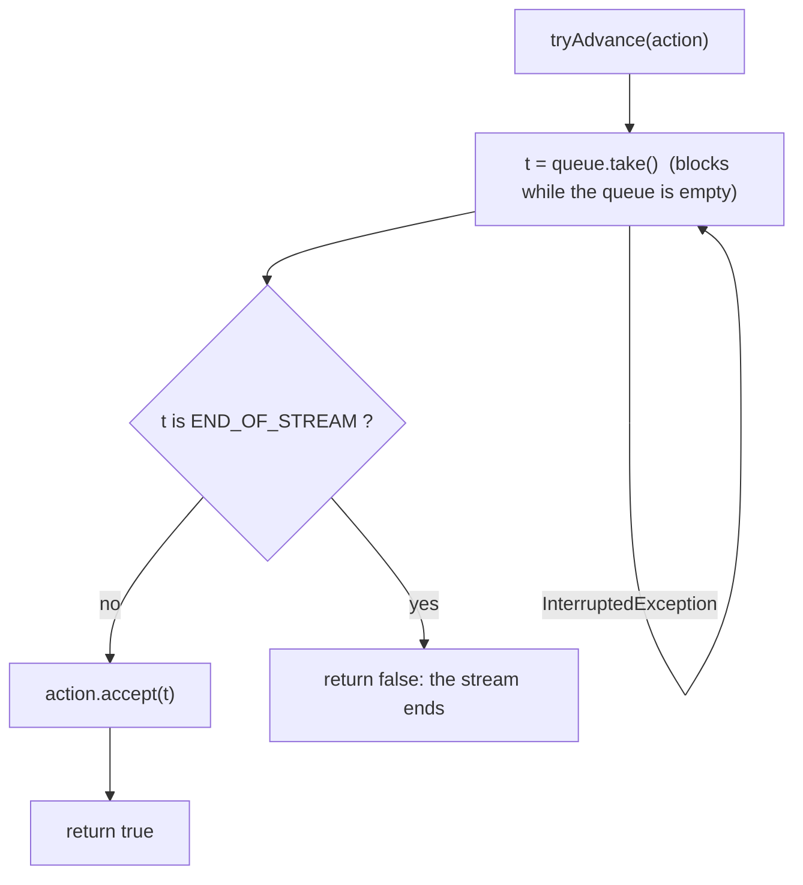
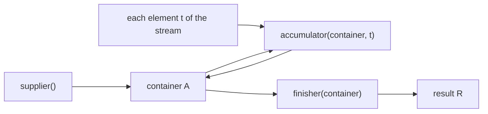
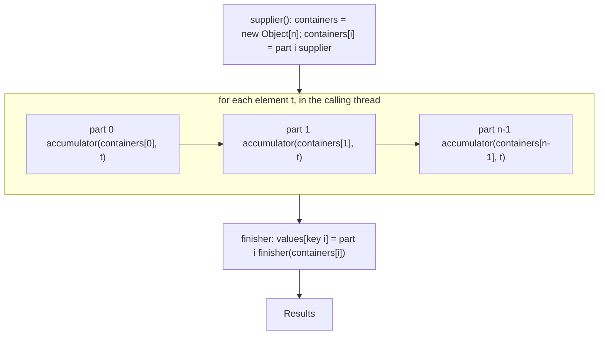
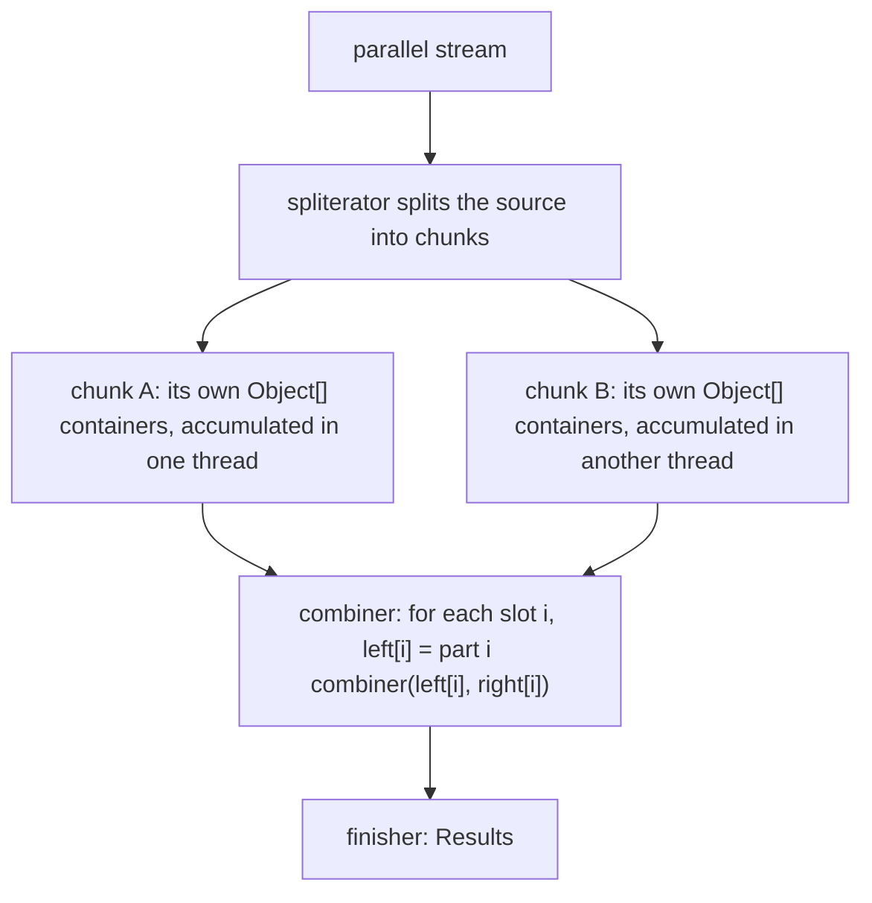
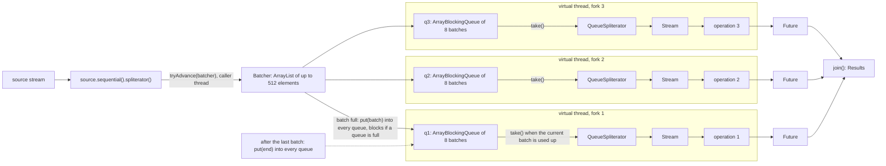
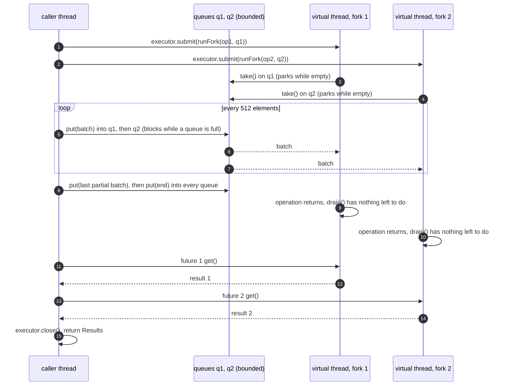
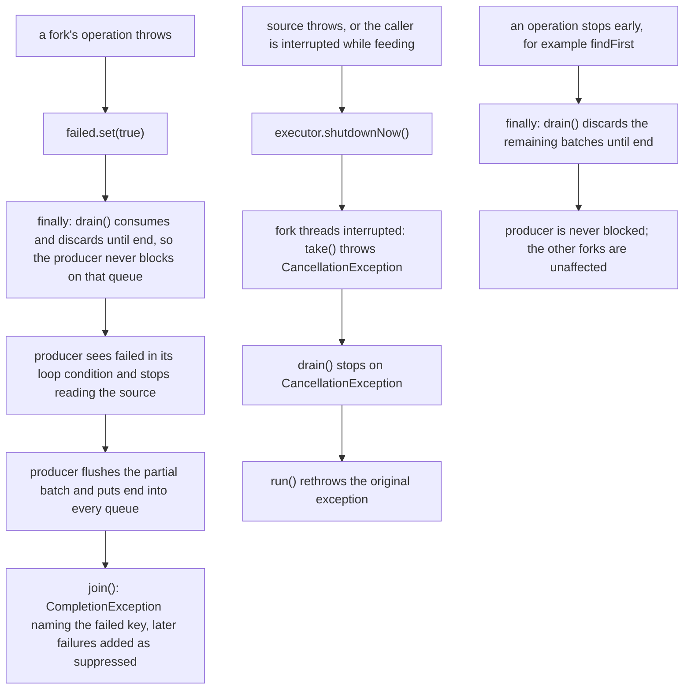
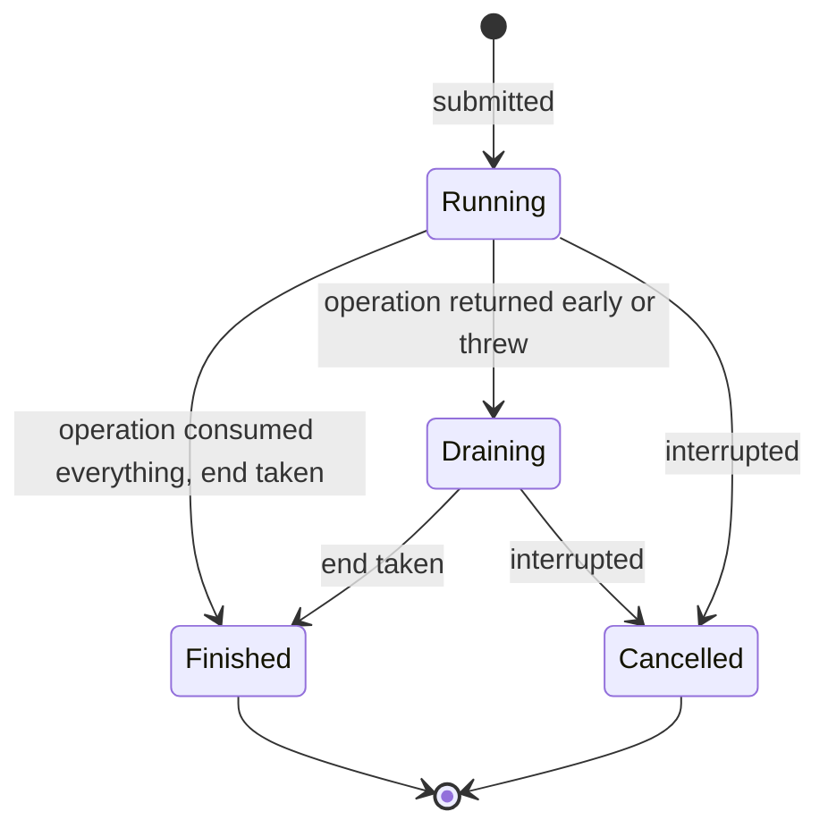

# Forking a Stream: three implementations

One source stream, several results, one traversal. This document explains three ways to do it, each with a data-flow diagram, the full code, and a type-level walkthrough.

| # | Method | Runs operations | Operation type |
|---|---|---|---|
| 1 | **Book `StreamForker`** (Modern Java in Action, Appendix C) | concurrently, one pool thread per operation | `Function<Stream<T>, ?>` |
| 2 | **`MultiCollector`** (and the JDK's `Collectors.teeing`) | sequentially, in one pass, in the calling thread | `Collector<? super T, ?, R>` |
| 3 | **Modern `StreamForker`** (JDK 25) | concurrently, one virtual thread per operation | `Function<Stream<T>, R>` |

> **Scope.** The book excerpt starts at Listing C.2. Listing C.1 (fields, `fork`, `getResults`, `Results`) is not in it and is reconstructed from how the later listings use it. All code in this document was compiled with `-Xlint:all` (no warnings) and run on **JDK 25**. Statements tagged **(measured)** come from those runs. The test machine had **1 vCPU**: timings show overhead, not parallel speed-up.

## Contents

1. [Problem and terminology](#1-problem-and-terminology)
2. [Shared example](#2-shared-example)
3. [Method 1: Book StreamForker](#3-method-1-book-streamforker)
4. [Method 2: MultiCollector](#4-method-2-multicollector)
5. [Method 3: Modern StreamForker](#5-method-3-modern-streamforker)
6. [Demo: all three side by side](#6-demo-all-three-side-by-side)
7. [Comparison and choice](#7-comparison-and-choice)
8. [Verification](#8-verification)

---

## 1. Problem and terminology

A stream can be traversed once:

```java
Stream<Dish> s = menu.stream();
int total = s.mapToInt(Dish::calories).sum();
s.map(Dish::name).toList();
// IllegalStateException: stream has already been operated upon or closed   (measured)
```

The goal is to compute several independent results from a single traversal.

| Alternative | Limitation |
|---|---|
| Call `menu.stream()` once per result | Requires a source that is cheap and replayable. `Files.lines(file)` re-reads the file each time; a socket or cursor cannot be replayed. |
| `collect(toList())` first, then stream the list repeatedly | O(n) memory. |
| Fork the stream (this document) | One traversal. |

**Terminology used throughout**

- **Push:** the producer calls a callback for each element (`Stream.forEach(consumer)`, `Consumer.accept`).
- **Pull:** the consumer asks for the next element (`Spliterator.tryAdvance`, `BlockingQueue.take`). A stream's terminal operation pulls from its `Spliterator`.
- **Fork:** one operation (a function over a `Stream`, or a `Collector`) registered under a key.

Methods 1 and 3 receive elements by push (from the source) and must hand them to N stream pipelines that pull. They convert push to pull with one blocking queue and one custom `Spliterator` per fork. Method 2 avoids the conversion by running all accumulators inside a single `Collector`.

---

## 2. Shared example

Four operations over the Chapter 4 menu:

| Operation | Result type |
|---|---|
| comma-separated dish names | `String` |
| total calories | `int` |
| dish with the most calories | `Dish` |
| dishes grouped by type | `Map<Dish.Type, List<Dish>>` |

```java
package forking;

import java.util.List;

/** Menu data model (Chapter 4), shared by all three demos. */
public record Dish(String name, boolean vegetarian, int calories, Dish.Type type) {

    public enum Type { MEAT, FISH, OTHER }

    @Override public String toString() { return name; }

    public static final List<Dish> MENU = List.of(
        new Dish("pork",         false, 800, Type.MEAT),
        new Dish("beef",         false, 700, Type.MEAT),
        new Dish("chicken",      false, 400, Type.MEAT),
        new Dish("french fries", true,  530, Type.OTHER),
        new Dish("rice",         true,  350, Type.OTHER),
        new Dish("season fruit", true,  120, Type.OTHER),
        new Dish("pizza",        true,  550, Type.OTHER),
        new Dish("prawns",       false, 300, Type.FISH),
        new Dish("salmon",       false, 450, Type.FISH));
}
```

Expected output (the book prints `4300` for total calories, but the Chapter 4 data sums to `4200`; this is a data slip in the book and does not affect the mechanics):

```
Short menu:        pork, beef, chicken, french fries, rice, season fruit, pizza, prawns, salmon
Total calories:    4200
Most caloric dish: pork
Dishes by type:    {FISH=[prawns, salmon], OTHER=[french fries, rice, season fruit, pizza], MEAT=[pork, beef, chicken]}
```

(`HashMap` ordering of the enum keys varies between runs.)

---

## 3. Method 1: Book StreamForker

### 3.1 Data flow



Left of the queues the data is **pushed** (by `forEach`). Right of the queues it is **pulled** (by each fork's terminal operation, through its Spliterator). The second row of boxes (Spliterator, Stream, function) runs on a pool thread per fork.

### 3.2 Execution order

```mermaid
sequenceDiagram
    autonumber
    participant M as caller thread
    participant Q as queues q1, q2
    participant P1 as pool thread, fork 1
    participant P2 as pool thread, fork 2

    M->>M: build(): create q1 and stream 1
    M->>P1: supplyAsync(f1 over stream 1)
    M->>M: build(): create q2 and stream 2
    M->>P2: supplyAsync(f2 over stream 2)
    Note over M,P2: Each fork starts when the pool schedules it. Elements pushed earlier wait in its queue.
    P1->>Q: take() on q1 (blocks while empty)
    P2->>Q: take() on q2 (blocks while empty)
    loop each source element t
        M->>Q: q1.add(t), q2.add(t)
        Q-->>P1: t
        Q-->>P2: t
    end
    M->>Q: finish(): add(END_OF_STREAM) to q1 and q2
    M-->>M: getResults() returns, forks may still be running
    P1->>P1: take() returns END_OF_STREAM, stream ends, f1 returns
    P2->>P2: take() returns END_OF_STREAM, stream ends, f2 returns
    M->>P1: results.get(key1) = Future.get()
    P1-->>M: result 1
    M->>P2: results.get(key2) = Future.get()
    P2-->>M: result 2
```



Measured with three elements and two forks (thread names shortened):

```
[commonPool-worker-1] fork 'cnt' starts its terminal op
[main]                source emits 1
[commonPool-worker-2] fork 'sum' starts its terminal op      <- started after element 1 was emitted
[main]                source emits 2
[main]                source emits 3
[main]                getResults() returned                   <- before the forks finished
[commonPool-worker-2] fork 'sum' done = 6
[commonPool-worker-1] fork 'cnt' done = 3
```

Two precise statements follow from this:

- Forks are *submitted* before the traversal, but their start time is up to the scheduler. This is safe because elements wait in the queue.
- `getResults()` does not wait for the **forks**, but it **does block for the entire traversal of the source** (the `forEach` is synchronous in the caller's thread).

### 3.3 Code

```java
package forking;

import java.util.*;
import java.util.concurrent.*;
import java.util.function.*;
import java.util.stream.*;

/**
 * The book's StreamForker (Modern Java in Action, Appendix C), renamed so it can coexist with
 * the modern version in one package. Logic is unchanged.
 *
 * One queue per operation. The source is pushed into all queues; each queue is turned back into
 * a Stream by a Spliterator and processed by its function on a pool thread.
 *
 * Listing C.1 (fields, fork, getResults, Results) is not in the excerpt; it is reconstructed.
 */
public class BookStreamForker<T> {

    private final Stream<T> stream;                                             // the single source
    private final Map<Object, Function<Stream<T>, ?>> forks = new HashMap<>(); // key -> operation

    public BookStreamForker(Stream<T> stream) {
        this.stream = stream;
    }

    /** Registers an operation under a key. Nothing runs until getResults(). */
    public BookStreamForker<T> fork(Object key, Function<Stream<T>, ?> f) {
        forks.put(key, f);
        return this;
    }

    /**
     * Starts all operations, then traverses the source once, synchronously, in the caller's thread.
     * Returns without waiting for the operations to finish.
     */
    public Results getResults() {
        ForkingStreamConsumer<T> consumer = build();
        try {
            stream.sequential().forEach(consumer);   // push each element into every queue
        } finally {
            consumer.finish();                       // always signal the end, even if the source throws
        }
        return consumer;                             // exposed only through the narrow Results type
    }

    /** Read side: get(key) blocks until that operation has completed. */
    public interface Results {
        <R> R get(Object key);
    }

    // ---- Listing C.2 ------------------------------------------------------------------------

    /** Creates one queue and one running Future per fork. */
    private ForkingStreamConsumer<T> build() {
        List<BlockingQueue<T>> queues = new ArrayList<>();                      // one queue per operation
        Map<Object, Future<?>> actions =                                        // key -> Future of its result
            forks.entrySet().stream().reduce(
                new HashMap<Object, Future<?>>(),                               // identity: mutated in place
                (map, e) -> {
                    map.put(e.getKey(), getOperationResult(queues, e.getValue()));
                    return map;
                },
                (m1, m2) -> { m1.putAll(m2); return m1; });                     // combiner: unused (sequential)
        return new ForkingStreamConsumer<>(queues, actions);
    }

    // ---- Listing C.3 ------------------------------------------------------------------------

    /** Wires one fork: queue -> Spliterator -> Stream -> function running asynchronously. */
    private Future<?> getOperationResult(List<BlockingQueue<T>> queues, Function<Stream<T>, ?> f) {
        BlockingQueue<T> queue = new LinkedBlockingQueue<>();                   // unbounded
        queues.add(queue);                                                      // the consumer will feed it
        Spliterator<T> spliterator = new BlockingQueueSpliterator<>(queue);     // reads elements from the queue
        Stream<T> source = StreamSupport.stream(spliterator, false);            // sequential Stream over it
        // Starts immediately on the common pool; blocks on the still-empty queue until elements arrive.
        return CompletableFuture.supplyAsync(() -> f.apply(source));
    }

    // ---- Listing C.4 ------------------------------------------------------------------------

    /** Push side: copies every element into all queues. Also serves as the Results handle. */
    static class ForkingStreamConsumer<T> implements Consumer<T>, Results {
        static final Object END_OF_STREAM = new Object();                       // poison pill, compared by identity

        private final List<BlockingQueue<T>> queues;
        private final Map<Object, Future<?>> actions;

        ForkingStreamConsumer(List<BlockingQueue<T>> queues, Map<Object, Future<?>> actions) {
            this.queues = queues;
            this.actions = actions;
        }

        /** Called by source.forEach for every element. */
        @Override
        public void accept(T t) {
            queues.forEach(q -> q.add(t));
        }

        /** Sends the poison pill through the same path as a normal element. */
        @SuppressWarnings("unchecked")
        void finish() {
            accept((T) END_OF_STREAM);                                          // unchecked, but T is erased
        }

        /** Blocks until the operation's Future completes. */
        @Override
        @SuppressWarnings("unchecked")
        public <R> R get(Object key) {
            try {
                return ((Future<R>) actions.get(key)).get();
            } catch (Exception e) {
                throw new RuntimeException(e);
            }
        }
    }

    // ---- Listing C.5 ------------------------------------------------------------------------

    /** Pull side: a Spliterator whose elements come from a BlockingQueue. */
    static class BlockingQueueSpliterator<T> implements Spliterator<T> {
        private final BlockingQueue<T> q;

        BlockingQueueSpliterator(BlockingQueue<T> q) {
            this.q = q;
        }

        /** Waits for the next element; returns false when the poison pill arrives. */
        @Override
        public boolean tryAdvance(Consumer<? super T> action) {
            T t;
            while (true) {
                try {
                    t = q.take();                       // blocks while the queue is empty
                    break;
                } catch (InterruptedException e) { }    // swallowed: the fork cannot be cancelled
            }
            if (t != ForkingStreamConsumer.END_OF_STREAM) {
                action.accept(t);                       // hand the element to the stream pipeline
                return true;
            }
            return false;                               // pill seen: the stream ends
        }

        @Override public Spliterator<T> trySplit() { return null; }  // a live queue cannot be split
        @Override public long estimateSize()       { return 0; }     // unknown (Long.MAX_VALUE is correct)
        @Override public int characteristics()     { return 0; }     // no flags (ORDERED would be correct)
    }
}
```

### 3.4 Class-by-class walkthrough

**`BookStreamForker<T>` (builder)**

- `fork(key, f)` only stores the pair in a `HashMap` and returns `this`. No queue exists yet because the number of forks is unknown until `getResults()`.
- `getResults()` has three steps: `build()` wires queues and futures; `stream.sequential().forEach(consumer)` pushes every element; `consumer.finish()` (in `finally`) sends the end marker. If the source throws, `finally` still ends every fork, which then completes on partial data.
- It returns the consumer typed as `Results`, which hides `accept` and `finish`.

**`build()` and `getOperationResult` (Listings C.2 and C.3).** For two forks:

```
start                queues = []                  actions = {}
fork "count":        q1 = new LinkedBlockingQueue   queues = [q1]
                     S1 = StreamSupport.stream(new BlockingQueueSpliterator(q1), false)
                     supplyAsync(() -> f_count.apply(S1))     actions = {"count" -> Future1}
fork "sum":          same with q2 / S2 / Future2   queues = [q1, q2]
return               new ForkingStreamConsumer(queues, actions)
```

`S1` is a `Stream` created over an **empty** queue. Nothing is read from it until its terminal operation runs on the pool thread.

**`ForkingStreamConsumer` (Listing C.4).** Source `[x, y]`, two forks:

```
accept(x)  ->  q1=[x]         q2=[x]
accept(y)  ->  q1=[x,y]       q2=[x,y]
finish()   ->  q1=[x,y,END]   q2=[x,y,END]
```

It implements `Consumer<T>` so it can be passed to `forEach`, and `Results` so one object holds both the queues and the futures.

**`END_OF_STREAM`.** A stream ends when `tryAdvance` returns `false`, but a queue has no "closed" state. The end is therefore an in-band marker: `new Object()`, compared with `!=` (identity), so no real element can match it.

**Threads are required.** Each fork's terminal operation is a blocking pull loop. Running it in the caller's thread would block on the empty queue before the caller had pushed anything. `CompletableFuture.supplyAsync` provides the thread and the result holder. With no executor argument it uses `ForkJoinPool.commonPool()` (a thread per task when the common pool has parallelism below 2).

### 3.5 The Spliterator in depth

**What it is.** A `Spliterator` is an iterator that can also split itself (for parallel processing) and reports characteristics about its elements. A `Stream` is a pipeline of operations over a `Spliterator`:

```java
list.stream()   ==   StreamSupport.stream(list.spliterator(), /* parallel */ false)
```

**How a terminal operation uses it.** Non-short-circuiting operations (`sum`, `collect`, `count`) call `forEachRemaining`, whose default implementation loops `tryAdvance`. Short-circuiting operations (`findFirst`, `anyMatch`, `limit`) call `tryAdvance` and check for cancellation between elements.

**The four methods**

| Method | Contract | Book returns | Correct value |
|---|---|---|---|
| `boolean tryAdvance(Consumer<? super T>)` | If an element remains, pass it to the consumer and return `true`; otherwise return `false`. | blocks on the queue | same |
| `Spliterator<T> trySplit()` | Split off a part for another thread, or return `null` ("not splittable"). | `null` | `null` |
| `long estimateSize()` | Estimated remaining elements; `Long.MAX_VALUE` if unknown or infinite. | `0` | `Long.MAX_VALUE` |
| `int characteristics()` | Bit flags: `ORDERED`, `SIZED`, `SUBSIZED`, `DISTINCT`, `SORTED`, `NONNULL`, `IMMUTABLE`, `CONCURRENT`. | `0` | `ORDERED` |

**`tryAdvance` step by step**



Trace with queue `[a, b, END]`:

| Call | `take()` returns | Effect | Returns |
|---|---|---|---|
| 1 | `a` | `action.accept(a)` | `true` |
| 2 | `b` | `action.accept(b)` | `true` |
| 3 | `END` | none | `false`: stream finished |

If the queue is empty at any call, `take()` blocks until the producer adds an element.

**Minimal standalone example** (output `[10, 20, 30]`, measured): a Spliterator over a queue, a second thread pushing into it.

```java
import java.util.*;
import java.util.concurrent.*;
import java.util.function.Consumer;
import java.util.stream.StreamSupport;

public class PushPull {
    public static void main(String[] args) throws Exception {
        BlockingQueue<Object> queue = new LinkedBlockingQueue<>();
        Object END = new Object();

        // PULL side: a Spliterator whose elements come from the queue
        Spliterator<Integer> source = new Spliterators.AbstractSpliterator<>(Long.MAX_VALUE, Spliterator.ORDERED) {
            @Override public boolean tryAdvance(Consumer<? super Integer> action) {
                try {
                    Object o = queue.take();                  // blocks until the producer pushes something
                    if (o == END) return false;               // marker -> "no more elements"
                    action.accept((Integer) o);
                    return true;
                } catch (InterruptedException e) {
                    Thread.currentThread().interrupt();
                    return false;
                }
            }
        };

        // PUSH side: some other thread produces at its own pace
        Thread.startVirtualThread(() -> { for (int i = 1; i <= 3; i++) queue.add(i); queue.add(END); });

        System.out.println(StreamSupport.stream(source, false).map(i -> i * 10).toList());
    }
}
```

**Why a Spliterator and not an `Iterator`**

- The Stream API is built on `Spliterator` (`StreamSupport.stream(Spliterator, boolean)`). An `Iterator` would have to be wrapped with `Spliterators.spliteratorUnknownSize` anyway.
- `Iterator.hasNext()` must answer without consuming an element. Over a blocking queue that requires taking the element, storing it in a field, and returning it from `next()`. `tryAdvance` performs wait, fetch, and delivery in one call and needs no look-ahead state.

**Late binding.** The `Spliterator` Javadoc defines a *late-binding* spliterator as one that binds to its data source at first traversal, split, or size query, not at creation. The book uses the term for the property it depends on: the stream is built before any data exists and reads nothing until the terminal operation runs. Measured: build the stream, fill the queue afterwards, then run the terminal operation.

```
stream built, queue size = 0 (nothing consumed, nothing blocked)
queue filled AFTER building the stream, size = 3
map sees a
map sees b
terminal op -> [a, b]
```

`getOperationResult` relies on exactly this: it builds `S1` over an empty queue long before the first push.

**`trySplit()` returns `null`.** Splitting lets a parallel stream give parts of the source to different threads. A live queue cannot be split: its future elements do not exist yet, it has no random access, and its size is unknown. `null` means "not splittable", so even a `.parallel()` pipeline would traverse it sequentially.

**Two inaccuracies in the book's Spliterator (measured):**

- `estimateSize()` returns `0` (meaning "empty") where the contract says `Long.MAX_VALUE` for unknown. Harmless in a sequential, non-`SIZED` stream: `getExactSizeIfKnown()` is `-1`.
- `characteristics()` returns `0`, so the fork's stream is *unordered* (`ORDERED declared? false`). The FIFO queue does preserve the order in which the source delivered elements, so `ORDERED` is the accurate flag. In a sequential pipeline the difference is not observable.

### 3.6 Types and generics

| Declaration | Meaning |
|---|---|
| `BookStreamForker<T>` | `T` is the element type of the source. |
| `Function<Stream<T>, ?> f` | Takes the fork's `Stream<T>`; returns some unspecified type. `?` lets each fork return a different type (`String`, `Integer`, `Map`). |
| `Map<Object, Function<Stream<T>, ?>>` | Keys are arbitrary objects (strings in practice); values lose their result type. |
| `<R> R get(Object key)` | Generic *return* type with no link to the stored result: `R` is inferred from the assignment target. |
| `Future<?>` | Result holder of unknown type. |
| `BlockingQueue<T>` | Holds elements of type `T` and, through an unchecked cast, the end marker. |
| `Consumer<? super T>` (in `tryAdvance`) | The consumer may accept `T` or any supertype of `T`. |
| `static class ForkingStreamConsumer<T>` | A static nested class declares its own `T`, independent of the outer `T`. |

**Lambda typing.** A lambda targeting `Function<Stream<T>, ?>` is typed as `Function<Stream<T>, Object>` (a wildcard in a functional interface target is replaced by its bound). `s -> s.count()` therefore returns a boxed `Long`, and `s -> 7` an `Integer` (measured).

**`get` is unchecked.** `int total = results.get("totalCalories")` infers `R = Integer`. The compiler cannot check that against the fork. Failures happen at runtime (measured):

```java
String wrong = r.get("total");   // ClassCastException: Integer cannot be cast to String   (at the call site)
Integer x    = r.get("nope");    // RuntimeException caused by NullPointerException (actions.get(key) is null)
```

**`reduce` with three arguments.** `<U> U reduce(U identity, BiFunction<U, ? super E, U> accumulator, BinaryOperator<U> combiner)`, here `E = Map.Entry<Object, Function<Stream<T>, ?>>` and `U = HashMap<Object, Future<?>>`. The explicit type arguments on `new HashMap<Object, Future<?>>()` fix `U`. The accumulator mutates the identity map and returns it. `reduce` expects an immutable identity, so this is correct only because the stream is sequential and the combiner is never called. A plain loop would be the accurate tool.

**The end marker and erasure.** `END_OF_STREAM` is an `Object`. `(T) END_OF_STREAM` is an unchecked cast that does nothing at runtime (type erasure), so a `BlockingQueue<String>` can contain a non-`String`. This is harmless only because `tryAdvance` compares against the marker *before* passing the value to `action`. The `@SuppressWarnings("unchecked")` annotations mark these spots.

**`supplyAsync(() -> f.apply(source))`.** `f.apply` returns the capture of `?`, so the call yields a `CompletableFuture<CAP#1>`, which is assignable to `Future<?>`.

### 3.7 Design choices

| Choice | Reason | Cost |
|---|---|---|
| Fork = `Function<Stream<T>, ?>` | Any stream operation is allowed, including primitive streams, `sorted`, `limit`. | Weak typing of results and keys. |
| One queue per fork | Every fork needs every element; a shared queue would deliver each element to one consumer only. | Work and memory grow with the number of forks. |
| Blocking queue as the bridge | Converts push to pull and decouples producer and consumer speed. | One lock-protected queue operation per element per fork. |
| Custom `Spliterator` | The way to feed a `Stream` from a blocking source. | Low-level code. |
| Thread per fork | Each fork is a blocking pull loop. | Threads, taken from the common pool. |
| In-band end marker | A queue has no closed state. | Unchecked cast; `null` elements cannot be queued. |
| Unbounded `LinkedBlockingQueue` + `add` | `add` never blocks or throws, so the producer needs no interrupt or back-pressure handling. | Unbounded memory. |
| Builder with deferred wiring | Queue count is unknown until all forks are registered. | Single-use. |
| Consumer that is also `Results` | One object holds queues and futures. | Mixed responsibilities. |

### 3.8 Limitations

All reproduced on JDK 25:

| Limitation | Observed behavior |
|---|---|
| Unbounded queues | **(measured)** 30M elements, two slow forks, `-Xmx48m`: the heap stayed at `44M->44M` through **1,284 Full GCs** (almost every collection in the log) and the process was killed at 80 s. The bounded Method 3 finished the same job in the same heap. |
| A fork that stops early leaks | **(measured)** With `findFirst` on a 2M-element source, that fork's queue retained 2,000,000 entries (1,999,999 elements plus the end marker). |
| `null` elements | **(measured)** `NullPointerException`: `LinkedBlockingQueue` rejects `null`. |
| Failures are late | **(measured)** `getResults()` returns normally; a fork's exception surfaces only in `get(key)`, wrapped as `RuntimeException(ExecutionException)`. The failed fork's queue is never drained. |
| Source failure | `finally` ends every fork, which completes on partial data; the source's exception propagates and the forks' results are lost. |
| Interrupts swallowed | `catch (InterruptedException e) { }` clears the flag and retries, so a fork cannot be cancelled. |
| Common pool | **(measured)** With parallelism forced to 2 and four forks, all four ran: the pool added spare threads while the forks blocked. No deadlock, but each fork occupies a platform thread in a pool shared with parallel streams. |
| Cost per element | **(measured)** see [section 7](#7-comparison-and-choice). |

---

## 4. Method 2: MultiCollector

All operations run in **one pass in the calling thread**. There are no queues, no threads, and no Spliterator conversion. Each operation is a `Collector`, and a single composite collector feeds every element to all of them.

### 4.1 Anatomy of `Collector<T, A, R>`

| Part | Type | Role |
|---|---|---|
| `supplier` | `Supplier<A>` | creates a mutable container |
| `accumulator` | `BiConsumer<A, T>` | folds one element into the container |
| `combiner` | `BinaryOperator<A>` | merges two containers (parallel streams) |
| `finisher` | `Function<A, R>` | converts the container to the result |
| `characteristics` | `Set<Collector.Characteristics>` | `CONCURRENT`, `UNORDERED`, `IDENTITY_FINISH` |

`T` is the element type, `A` the container type (an implementation detail), `R` the result type. `A` differs per collector: `joining` uses a `StringJoiner`, `summingInt` an `int[1]`, `groupingBy` a `Map`.



### 4.2 The JDK built-in: `Collectors.teeing` (JDK 12)

```java
static <T, R1, R2, R> Collector<T, ?, R> teeing(
        Collector<? super T, ?, R1> downstream1,
        Collector<? super T, ?, R2> downstream2,
        BiFunction<? super R1, ? super R2, R> merger)
```

Two collectors, one pass, results combined by `merger`. Four operations by nesting (output identical to the book's, measured). Here `byCalories` is `Comparator.comparingInt(Dish::calories)` and `Summary` is the four-field record from [section 6](#6-demo-all-three-side-by-side):

```java
Summary s = menu.stream().collect(teeing(
    teeing(mapping(Dish::name, joining(", ")), summingInt(Dish::calories), Map::entry),
    teeing(maxBy(byCalories), groupingBy(Dish::type), Map::entry),
    (x, y) -> new Summary(x.getKey(), x.getValue(), y.getKey().orElseThrow(), y.getValue())));
```

This is enough for two to four operations. Beyond that, or for a dynamic set of operations, the nesting and the intermediate pairs (`Map::entry`) become unwieldy. `MultiCollector` generalises it to N keyed collectors.

### 4.3 Data flow of `MultiCollector`

Sequential stream:



Parallel stream (**measured**: on 2M elements the combiner ran 15 times and the result equalled the sequential one):



Note the difference from Methods 1 and 3: parallelism here is **data parallelism** (different elements on different threads) and requires each collector to be combinable. Methods 1 and 3 have **task parallelism** (different operations on different threads) over a sequential traversal.

### 4.4 Code

Typed key and result container (also used by Method 3):

```java
package forking;

/** Typed, identity-based key: the result type R travels with the key, so call sites need no casts. */
public final class Key<R> {
    private final String name;

    private Key(String name) { this.name = name; }

    public static <R> Key<R> of(String name) { return new Key<>(name); }

    @Override public String toString() { return name; }
}
```

```java
package forking;

import java.util.Collections;
import java.util.Map;
import java.util.NoSuchElementException;

/** Immutable bag of results, read back with the same typed {@link Key} used to register them. */
public final class Results {
    private final Map<Key<?>, Object> values;

    Results(Map<Key<?>, Object> values) { this.values = Collections.unmodifiableMap(values); }

    @SuppressWarnings("unchecked") // safe: builders only ever store an R under a Key<R>
    public <R> R get(Key<R> key) {
        if (!values.containsKey(key)) throw new NoSuchElementException("No result for key '" + key + "'");
        return (R) values.get(key);
    }
}
```

The collector:

```java
package forking;

import java.util.LinkedHashMap;
import java.util.List;
import java.util.Map;
import java.util.function.BiConsumer;
import java.util.function.BinaryOperator;
import java.util.function.Function;
import java.util.function.Supplier;
import java.util.stream.Collector;

/**
 * Runs several Collectors over ONE traversal, in the calling thread: the N-ary, keyed
 * generalisation of {@link java.util.stream.Collectors#teeing}. Works on parallel streams too.
 */
public final class MultiCollector<T> {

    /** A registered collector with its container type erased (A is captured exactly once, in of()). */
    private record Part<T>(Supplier<Object> supplier, BiConsumer<Object, T> accumulator,
                           BinaryOperator<Object> combiner, Function<Object, Object> finisher) {
        @SuppressWarnings("unchecked") // safe: a container always comes from this same collector's supplier
        static <T, A> Part<T> of(Collector<? super T, A, ?> c) {
            return new Part<>(c.supplier()::get,
                              (a, t) -> c.accumulator().accept((A) a, t),
                              (x, y) -> c.combiner().apply((A) x, (A) y),
                              a -> c.finisher().apply((A) a));
        }
    }

    private final Map<Key<?>, Part<T>> parts = new LinkedHashMap<>();

    public <R> MultiCollector<T> add(Key<R> key, Collector<? super T, ?, R> collector) {
        if (parts.putIfAbsent(key, Part.of(collector)) != null)
            throw new IllegalArgumentException("Duplicate key '" + key + "'");
        return this;
    }

    public Collector<T, ?, Results> build() {
        var keys = List.copyOf(parts.keySet());
        var ps = List.copyOf(parts.values());
        int n = ps.size();
        return Collector.of(
            () -> {
                var containers = new Object[n];
                for (int i = 0; i < n; i++) containers[i] = ps.get(i).supplier().get();
                return containers;
            },
            (containers, t) -> {
                for (int i = 0; i < n; i++) ps.get(i).accumulator().accept(containers[i], t);
            },
            (left, right) -> {
                for (int i = 0; i < n; i++) left[i] = ps.get(i).combiner().apply(left[i], right[i]);
                return left;
            },
            containers -> {
                var out = new LinkedHashMap<Key<?>, Object>();
                for (int i = 0; i < n; i++) out.put(keys.get(i), ps.get(i).finisher().apply(containers[i]));
                return new Results(out);
            });
    }
}
```

Usage (`byCalories` as above):

```java
static final Key<String>                     NAMES    = Key.of("shortMenu");
static final Key<Integer>                    CALORIES = Key.of("totalCalories");
static final Key<Optional<Dish>>             TOP      = Key.of("mostCaloricDish");
static final Key<Map<Dish.Type, List<Dish>>> BY_TYPE  = Key.of("dishesByType");

Results r = menu.stream().collect(new MultiCollector<Dish>()
    .add(NAMES,    mapping(Dish::name, joining(", ")))
    .add(CALORIES, summingInt(Dish::calories))
    .add(TOP,      maxBy(byCalories))
    .add(BY_TYPE,  groupingBy(Dish::type))
    .build());

String names = r.get(NAMES);        // no cast
```

### 4.5 Walkthrough of `build()`

1. `keys` and `ps` are immutable snapshots of the registered keys and `Part`s; `n` is the number of collectors.
2. **supplier:** allocates `Object[n]` and fills slot `i` with `ps.get(i).supplier().get()`. One slot per collector, because the container types differ.
3. **accumulator:** for each element, calls `ps.get(i).accumulator().accept(containers[i], t)` for every `i`.
4. **combiner:** for each slot, merges the right container into the left with that part's combiner. Used only by parallel streams.
5. **finisher:** applies each part's finisher to its container and returns a `Results` whose map preserves registration order.

### 4.6 Types and generics

| Declaration | Meaning |
|---|---|
| `Key<R>` | Phantom type parameter: `R` is never stored; it only links a key to a result type. The class has no `equals`, so keys compare by identity: two keys with the same name but different `R` cannot collide. |
| `add(Key<R> key, Collector<? super T, ?, R> collector)` | See below. |
| `Part<T>` (record) | A collector with its container type erased to `Object`: four lambdas. |
| `Part.of(Collector<? super T, A, ?> c)` | Generic method that gives the container type the name `A`. |
| `Collector<T, ?, Results>` (from `build`) | The composite container type (`Object[]`) is hidden behind `?`. |
| `Results.get(Key<R>)` returns `R` | Typed read-back, no caller cast. |

**`Collector<? super T, ?, R>` in `add`, parameter by parameter**

- **`R`** is the *same* `R` as in `Key<R>`. The compiler rejects a mismatch (measured):

  ```
  new MultiCollector<Dish>().add(CAL /* Key<Integer> */, mapping(Dish::name, joining(", ")));
  error: inference variable R has incompatible equality constraints Integer,String
  ```
- **`? super T`** (contravariance): a collector that accepts a supertype of `Dish` can consume `Dish`. A `Collector<Object, ?, Long>` is accepted for `MultiCollector<Dish>`; a `Collector<String, ?, Long>` is rejected (both measured).
- **`?`** (container): the caller's collector has some container type that the caller does not need to know.

**Capture conversion in `Part.of`.** `add` passes a `Collector<? super T, ?, R>` to `Part.of(Collector<? super T, A, ?> c)`. At that call the compiler replaces the `?` with a fresh type variable and binds it to `A`. Inside `of`, `A` is an ordinary type variable, so `c.accumulator().accept((A) a, t)` type-checks. This is the only way to name an unknown container type. The returned `Part<T>` stores lambdas typed over `Object`, so `A` disappears from the signature.

**Why the `(A) a` casts are safe.** They are unchecked and have no runtime effect (erasure). They are correct because slot `i` of the composite container is created by part `i`'s supplier and only ever passed to part `i`'s functions.

**Why `Object[]`.** The containers have different, unrelated types. A fixed-size array of `Object` is the simplest heterogeneous container (the alternative is a family of tuple types per arity). `Collector.of` infers the composite as `Collector<T, Object[], Results>`; returning it as `Collector<T, ?, Results>` keeps `Object[]` private.

**Why `Results.get`'s cast is safe.** `(R) values.get(key)` is unchecked. The map is only filled by `build()`, from entries that `add` paired as (`Key<R>`, collector producing `R`).

**No characteristics are declared** (`CONCURRENT`, `UNORDERED`, `IDENTITY_FINISH` are absent): the safe default for any combination of component collectors.

### 4.7 Properties and limits

- No threads, queues, or allocation per element beyond what the collectors themselves do.
- Works on sequential and parallel streams.
- Operations are limited to what `Collector`s can express. `sorted()`, `limit()`, and `skip()` have no collector equivalent without writing a custom collector.
- A source of `n` elements costs O(n·k) accumulator calls for `k` collectors, all on one thread (sequential case). Operations do not overlap in time.

---

## 5. Method 3: Modern StreamForker

Same structure as Method 1 (push into per-fork queues, pull through a Spliterator, one thread per fork), rebuilt on JDK 21–25 features with bounded memory, batching, typed keys, and defined failure behavior.

### 5.1 Data flow



The same read-only batch object is put into every queue, so each element is copied into a batch once, not once per fork. A queue operation happens once per 512 elements per fork.

### 5.2 Execution order (normal run)



### 5.3 Failure and cancellation paths



Lifecycle of one fork:



### 5.4 Protocol invariants

1. A batch is never empty. `end` is a distinct, empty `ArrayList` compared with `==`.
2. The producer puts every batch into all queues in registration order, then puts `end` into all queues. Exception: when cancelled (`shutdownNow`).
3. **A fork never stops consuming before `end`**: either its operation reads up to `end`, or `drain()` does. Therefore a `put` on a bounded queue always eventually succeeds while all fork threads are alive.
4. A batch is read-only after it has been `put`. `BlockingQueue` gives the necessary happens-before, so sharing one batch among forks needs no copying or locking.
5. Buffered data per fork is bounded by `QUEUE_BATCHES x BATCH_SIZE` elements (4,096), plus the batch being filled and the batch being iterated.

### 5.5 Code

```java
package forking;

import java.util.ArrayList;
import java.util.Collections;
import java.util.Iterator;
import java.util.LinkedHashMap;
import java.util.List;
import java.util.Map;
import java.util.Objects;
import java.util.Spliterator;
import java.util.Spliterators;
import java.util.concurrent.ArrayBlockingQueue;
import java.util.concurrent.BlockingQueue;
import java.util.concurrent.CancellationException;
import java.util.concurrent.CompletionException;
import java.util.concurrent.ExecutionException;
import java.util.concurrent.Executors;
import java.util.concurrent.Future;
import java.util.concurrent.atomic.AtomicBoolean;
import java.util.function.Consumer;
import java.util.function.Function;
import java.util.stream.Stream;
import java.util.stream.StreamSupport;

/**
 * Runs several stream functions concurrently over ONE traversal of the source.
 * The caller's thread pushes elements, in batches, into one bounded queue per fork;
 * each fork pulls them back out as a Stream on its own virtual thread.
 */
public final class StreamForker<T> {

    private static final int BATCH_SIZE = 512;   // elements per queue hand-off
    private static final int QUEUE_BATCHES = 8;  // bounded: <= BATCH_SIZE * QUEUE_BATCHES elements in flight per fork

    private final Stream<T> source;
    private final Map<Key<?>, Function<Stream<T>, ?>> forks = new LinkedHashMap<>();

    private StreamForker(Stream<T> source) { this.source = Objects.requireNonNull(source); }

    public static <T> StreamForker<T> from(Stream<T> source) { return new StreamForker<>(source); }

    public <R> StreamForker<T> fork(Key<R> key, Function<Stream<T>, R> operation) {
        if (forks.putIfAbsent(key, operation) != null)
            throw new IllegalArgumentException("Duplicate key '" + key + "'");
        return this;
    }

    /** Traverses the source once; returns when every fork has finished. */
    public Results run() {
        final var end = new ArrayList<T>();            // poison pill: recognised by identity, never a real batch
        final var failed = new AtomicBoolean();        // a fork threw -> stop feeding early
        final var queues = new ArrayList<BlockingQueue<List<T>>>();
        final var futures = new LinkedHashMap<Key<?>, Future<?>>();

        try (var executor = Executors.newVirtualThreadPerTaskExecutor(); source) {
            forks.forEach((key, operation) -> {
                var queue = new ArrayBlockingQueue<List<T>>(QUEUE_BATCHES);
                queues.add(queue);
                futures.put(key, executor.submit(() -> runFork(operation, queue, end, failed)));
            });
            try {
                feed(queues, end, failed);
            } catch (Throwable t) {
                executor.shutdownNow();                // 'end' may not have reached every fork -> cancel them
                throw t;
            }
            return join(futures);
        }
    }

    // ---- producer side: pull from the source, push to every queue --------------------------------------------

    private void feed(List<BlockingQueue<List<T>>> queues, List<T> end, AtomicBoolean failed) {
        var batcher = new Batcher<T>(queues);
        var elements = source.sequential().spliterator();
        while (!failed.get() && elements.tryAdvance(batcher)) { /* one element per call */ }
        batcher.flush();
        broadcast(queues, end);
    }

    private static final class Batcher<T> implements Consumer<T> {
        private final List<BlockingQueue<List<T>>> queues;
        private List<T> batch = new ArrayList<>(BATCH_SIZE);

        Batcher(List<BlockingQueue<List<T>>> queues) { this.queues = queues; }

        @Override public void accept(T t) {
            batch.add(t);
            if (batch.size() == BATCH_SIZE) flush();
        }

        void flush() {
            if (batch.isEmpty()) return;
            broadcast(queues, batch);                  // the same read-only batch is shared by all forks
            batch = new ArrayList<>(BATCH_SIZE);
        }
    }

    private static <T> void broadcast(List<BlockingQueue<List<T>>> queues, List<T> batch) {
        try {
            for (var queue : queues) queue.put(batch); // blocks while a fork is behind: back-pressure
        } catch (InterruptedException e) {
            Thread.currentThread().interrupt();
            throw new CancellationException("Interrupted while feeding the forks");
        }
    }

    // ---- consumer side: one virtual thread per fork -----------------------------------------------------------

    private static <T, R> R runFork(Function<Stream<T>, R> operation, BlockingQueue<List<T>> queue,
                                    List<T> end, AtomicBoolean failed) {
        var elements = new QueueSpliterator<>(queue, end);
        try {
            return operation.apply(StreamSupport.stream(elements, false));
        } catch (Throwable t) {
            failed.set(true);
            throw t;
        } finally {
            elements.drain();  // invariant: a fork never stops consuming before 'end', so the producer can't block on it
        }
    }

    private static Results join(Map<Key<?>, Future<?>> futures) {
        var values = new LinkedHashMap<Key<?>, Object>();
        CompletionException failure = null;
        for (var entry : futures.entrySet()) {
            try {
                values.put(entry.getKey(), entry.getValue().get());
            } catch (ExecutionException e) {
                var wrapped = new CompletionException("Fork '" + entry.getKey() + "' failed", e.getCause());
                if (failure == null) failure = wrapped; else failure.addSuppressed(wrapped);
            } catch (InterruptedException e) {
                Thread.currentThread().interrupt();
                throw new CancellationException("Interrupted while waiting for the forks");
            }
        }
        if (failure != null) throw failure;
        return new Results(values);
    }

    /** Push -> pull adapter: a Spliterator whose elements arrive, batch by batch, through a BlockingQueue. */
    private static final class QueueSpliterator<T> extends Spliterators.AbstractSpliterator<T> {
        private final BlockingQueue<List<T>> queue;
        private final List<T> end;
        private Iterator<T> current = Collections.emptyIterator();
        private boolean finished;

        QueueSpliterator(BlockingQueue<List<T>> queue, List<T> end) {
            super(Long.MAX_VALUE, ORDERED);            // size unknown; encounter order = arrival order
            this.queue = queue;
            this.end = end;
        }

        @Override public boolean tryAdvance(Consumer<? super T> action) {
            while (!current.hasNext()) {
                if (finished) return false;
                var batch = take();
                if (batch == end) { finished = true; return false; }
                current = batch.iterator();
            }
            action.accept(current.next());
            return true;
        }

        @Override public Spliterator<T> trySplit() { return null; } // a live queue cannot be split

        void drain() {
            try {
                while (!finished) if (take() == end) finished = true;
            } catch (CancellationException _) { /* interrupted: stop draining (flag already restored) */ }
        }

        private List<T> take() {
            try {
                return queue.take();
            } catch (InterruptedException e) {
                Thread.currentThread().interrupt();
                throw new CancellationException("Interrupted while waiting for elements");
            }
        }
    }
}
```

### 5.6 Walkthrough

**`run()`**

1. Create the `end` sentinel, the `failed` flag, and the queue and future collections.
2. `try (var executor = newVirtualThreadPerTaskExecutor(); source)`: the executor and the source stream are closed when `run()` exits (source first, then the executor, which waits for all fork threads).
3. For each fork: create a bounded queue, register it, and submit `runFork(...)` on a new virtual thread.
4. `feed(...)`: the caller's thread pulls from the source and pushes batches. If it throws (source failure or interrupt), `shutdownNow()` cancels the forks and the exception is rethrown.
5. `join(futures)`: waits for every fork, builds `Results` or throws `CompletionException`.

**`feed(...)`.** `source.sequential().spliterator()` is pulled with `tryAdvance(batcher)`; the loop stops when the source is exhausted or `failed` is set. `Batcher.accept` adds to the current batch and calls `flush()` at 512 elements; `flush()` broadcasts the batch to every queue and starts a new one. After the loop: flush the partial batch, then broadcast `end`.

**`broadcast(...)`.** `queue.put(batch)` blocks while the queue is full: this is the back-pressure. `InterruptedException` restores the interrupt flag and throws `CancellationException`.

**`runFork(...)`.** Wraps the queue in a `QueueSpliterator`, builds a sequential `Stream` over it, and applies the operation. On any exception it sets `failed` and rethrows. In `finally` it calls `drain()`.

**`QueueSpliterator.tryAdvance`.** Serves elements from the current batch's iterator. When that is exhausted it `take()`s the next batch. If the batch is `end` it sets `finished` and returns `false`. Because a batch is taken once per 512 elements, most calls touch no lock.

**`drain()`.** Consumes and discards batches until `end` has been seen (no-op if already seen). It guarantees invariant 3.

**`join(...)`.** Calls `Future.get()` on every future in registration order. The first failure becomes a `CompletionException("Fork 'key' failed", cause)`; later ones are attached with `addSuppressed`. An interrupt while waiting restores the flag and throws `CancellationException`; `executor.close()` then stops the forks.

### 5.7 Types and generics

| Declaration | Meaning |
|---|---|
| `StreamForker<T>` with `private` constructor and `static <T> from(Stream<T>)` | `T` is inferred from the argument: `from(menu.stream())` gives `T = Dish`. The book needs `new StreamForker<Dish>(...)`. |
| `fork(Key<R> key, Function<Stream<T>, R> operation)` | `R` is shared by key and function: the function's return type must match the key's. |
| `Map<Key<?>, Function<Stream<T>, ?>> forks` | The pairing is checked in `fork`; storage may erase `R`. |
| `BlockingQueue<List<T>>` | Queue elements are **batches**, not elements. |
| `List<T> end = new ArrayList<T>()` | Typed sentinel compared by identity: no `Object` and no unchecked cast. |
| `QueueSpliterator<T> extends Spliterators.AbstractSpliterator<T>` | Only `tryAdvance` (and `trySplit`) are written by hand. |
| `Batcher<T> implements Consumer<T>` | Passed to `tryAdvance(Consumer<? super T>)`. |

**Result type safety (measured).** The book's `fork("total", s -> s.map(...))` with a wrong expectation fails at runtime. Here the same mistake does not compile:

```
StreamForker.from(menu.stream()).fork(CAL /* Key<Integer> */, s -> s.map(Dish::name).collect(joining(", ")));
error: inference variable R has incompatible bounds
    equality constraints: String
    upper bounds: Integer,Object
```

A lambda returning `int` is boxed to `Integer` to match `Key<Integer>`.

**Wildcard capture in `runFork`.** The map's values are `Function<Stream<T>, ?>`. `runFork` is declared `<T, R> R runFork(Function<Stream<T>, R> operation, ...)`. Calling it with a wildcard-typed function makes the compiler capture the `?` as a type variable for that call. The result flows into `executor.submit(Callable<V>)` (capture again) and is stored as `Future<?>`. Declaring `runFork` generic is what makes the call type-check.

**Batches remove two restrictions.** Because the queue carries `List<T>` batches and the sentinel is a list, no element ever enters a queue on its own: `null` elements are allowed (measured: `Stream.of("a", null, "b")` counts 3), and no cast is needed.

**`Spliterators.AbstractSpliterator<T>`.** The constructor `super(Long.MAX_VALUE, ORDERED)` sets the estimated size to "unknown" and declares encounter order (the FIFO queue preserves delivery order). `trySplit()` is overridden to return `null`: the inherited implementation would pull a batch of elements from the queue (blocking) to split off.

**Java language features used**

- `catch (Throwable t) { ...; throw t; }` compiles without `throws` because of *precise rethrow*: the compiler knows the `try` body throws only unchecked exceptions.
- `try (var executor = ...; source)`: a `final` field can be a try-with-resources resource (JDK 9+). `ExecutorService` is `AutoCloseable` from JDK 19; its `close()` waits for tasks and, if the waiting thread is interrupted, calls `shutdownNow()`.
- `catch (CancellationException _)`: unnamed variable (JDK 22+).
- `Executors.newVirtualThreadPerTaskExecutor()`: virtual threads (JDK 21). A blocked `take()` or `put()` parks the virtual thread and frees its carrier.

### 5.8 Changes relative to Method 1

| Method 1 | Method 3 | Effect |
|---|---|---|
| `supplyAsync` on the common pool | Virtual thread per fork, executor closed by try-with-resources | Cheap blocking; no shared-pool use; no thread outlives `run()` |
| Unbounded `LinkedBlockingQueue` + `add` | Bounded `ArrayBlockingQueue` + `put` | Back-pressure; bounded memory |
| One queue operation per element per fork | Batches of 512 shared by all forks | About 512 times fewer queue operations |
| Hand-written four-method Spliterator | `AbstractSpliterator` with `ORDERED` and `Long.MAX_VALUE` | Correct metadata; less code |
| `Object` sentinel, `(T)` cast | Typed `List<T>` sentinel | No unchecked cast; `null` allowed |
| Nothing | `drain()` until `end` | A finished or failed fork cannot block the producer |
| Nothing | `failed` flag read by the producer | Fail-fast |
| Swallowed interrupts | Restore flag, `CancellationException`, `shutdownNow()` | Cancellable |
| `Object` keys, `<R> R get(Object)` | `Key<R>`, `Results.get(Key<R>)` | Compile-time result types |
| `getResults()` returns before forks finish | `run()` returns when all forks finish | No thread outlives the call; errors surface from `run()` |

### 5.9 Contract and trade-offs

- Each operation must **consume** the stream with a terminal operation. It must not return the stream or hand it to another thread; each fork's stream is single-threaded.
- Latency: a fork sees elements only when a batch of 512 is full or the source ends. This suits finite sources. For slow, live sources where latency matters, reduce `BATCH_SIZE`.
- The source is always traversed sequentially, even if the stream was `parallel()`.
- Test results (measured, JDK 25): **9 of 9 checks pass**: 3M elements with 3 forks; batch boundaries (0, 1, 511, 512, 513, 1024, 4103 elements); `null` elements; an early-terminating fork (`findFirst` on 3M elements); a failing fork aborting a 50M-element source in a few milliseconds; a source exception; a caller interrupt; duplicate key; unknown key.

---

## 6. Demo: all three side by side

`Demo.java` computes the same four results with each method and compares them with `equals`.

```java
package forking;

import java.util.Comparator;
import java.util.List;
import java.util.Map;
import java.util.Optional;

import static java.util.Comparator.comparingInt;
import static java.util.stream.Collectors.*;

/** The same four operations on the same menu, computed with each method. */
public class Demo {

    /** Common shape of the four results, so the methods can be compared with equals(). */
    record Summary(String names, int totalCalories, Dish mostCaloric, Map<Dish.Type, List<Dish>> byType) {}

    // Typed keys (methods 2 and 3): the type argument is the result type.
    static final Key<String>                     NAMES    = Key.of("shortMenu");
    static final Key<Integer>                    CALORIES = Key.of("totalCalories");
    static final Key<Optional<Dish>>             TOP      = Key.of("mostCaloricDish");
    static final Key<Map<Dish.Type, List<Dish>>> BY_TYPE  = Key.of("dishesByType");

    public static void main(String[] args) {
        List<Dish> menu = Dish.MENU;
        Comparator<Dish> byCalories = comparingInt(Dish::calories);

        // ---- Method 1: the book's StreamForker (Object keys, unchecked get) ----
        BookStreamForker.Results b = new BookStreamForker<Dish>(menu.stream())
            .fork("shortMenu",       s -> s.map(Dish::name).collect(joining(", ")))
            .fork("totalCalories",   s -> s.mapToInt(Dish::calories).sum())
            .fork("mostCaloricDish", s -> s.max(byCalories).orElseThrow())
            .fork("dishesByType",    s -> s.collect(groupingBy(Dish::type)))
            .getResults();
        Summary method1 = new Summary(b.get("shortMenu"), b.get("totalCalories"),
                                      b.get("mostCaloricDish"), b.get("dishesByType"));

        // ---- Method 2: MultiCollector (one pass, calling thread, typed keys) ----
        Results c = menu.stream().collect(new MultiCollector<Dish>()
            .add(NAMES,    mapping(Dish::name, joining(", ")))
            .add(CALORIES, summingInt(Dish::calories))
            .add(TOP,      maxBy(byCalories))
            .add(BY_TYPE,  groupingBy(Dish::type))
            .build());
        Summary method2 = new Summary(c.get(NAMES), c.get(CALORIES), c.get(TOP).orElseThrow(), c.get(BY_TYPE));

        // ---- Method 2b: the JDK built-in, nested Collectors.teeing (JDK 12+) ----
        Summary method2b = menu.stream().collect(teeing(
            teeing(mapping(Dish::name, joining(", ")), summingInt(Dish::calories), Map::entry),
            teeing(maxBy(byCalories), groupingBy(Dish::type), Map::entry),
            (x, y) -> new Summary(x.getKey(), x.getValue(), y.getKey().orElseThrow(), y.getValue())));

        // ---- Method 3: modern StreamForker (concurrent, bounded, typed) ----
        Results d = StreamForker.from(menu.stream())
            .fork(NAMES,    s -> s.map(Dish::name).collect(joining(", ")))
            .fork(CALORIES, s -> s.mapToInt(Dish::calories).sum())
            .fork(TOP,      s -> s.max(byCalories))
            .fork(BY_TYPE,  s -> s.collect(groupingBy(Dish::type)))
            .run();
        Summary method3 = new Summary(d.get(NAMES), d.get(CALORIES), d.get(TOP).orElseThrow(), d.get(BY_TYPE));

        System.out.println("Short menu:        " + method1.names());
        System.out.println("Total calories:    " + method1.totalCalories());
        System.out.println("Most caloric dish: " + method1.mostCaloric().name());
        System.out.println("Dishes by type:    " + method1.byType());
        System.out.println();
        System.out.println("method 1 (book)           == method 2 (MultiCollector): " + method1.equals(method2));
        System.out.println("method 2b (teeing)        == method 2 (MultiCollector): " + method2b.equals(method2));
        System.out.println("method 3 (modern forker)  == method 2 (MultiCollector): " + method3.equals(method2));
    }
}
```

Output (measured):

```
Short menu:        pork, beef, chicken, french fries, rice, season fruit, pizza, prawns, salmon
Total calories:    4200
Most caloric dish: pork
Dishes by type:    {FISH=[prawns, salmon], OTHER=[french fries, rice, season fruit, pizza], MEAT=[pork, beef, chicken]}

method 1 (book)           == method 2 (MultiCollector): true
method 2b (teeing)        == method 2 (MultiCollector): true
method 3 (modern forker)  == method 2 (MultiCollector): true
```

Layout and commands (JDK 22+ is required because of the unnamed variable `_`; developed on JDK 25):

```
src/forking/Dish.java
src/forking/Key.java
src/forking/Results.java
src/forking/MultiCollector.java
src/forking/BookStreamForker.java
src/forking/StreamForker.java
src/forking/Demo.java
```

```bash
javac -d out src/forking/*.java
java -cp out forking.Demo
```

---

## 7. Comparison and choice

| | Method 1: Book | Method 2: MultiCollector | Method 3: Modern |
|---|---|---|---|
| Passes over the source | 1 | 1 | 1 |
| Operation type | `Function<Stream<T>, ?>` | `Collector` | `Function<Stream<T>, R>` |
| Threads | common pool, one per fork | none (caller) | virtual thread per fork |
| Parallelism kind | task (operations overlap) | data (parallel stream), or none | task (operations overlap) |
| Parallel source stream | forced sequential | supported | forced sequential |
| Memory | unbounded | collector state only | bounded buffer |
| Back-pressure | none | not applicable | yes |
| `null` elements | `NullPointerException` | depends on the collectors | supported |
| Failure | late, wrapped, no cleanup | immediate, in the caller's thread | fail-fast, `CompletionException` with key |
| Cancellation | no | not applicable | yes |
| Result typing | unchecked (`ClassCastException`) | `Key<R>`, compile-time | `Key<R>`, compile-time |
| Measured, 5M elements, 3 cheap operations | 1112 ms | 61 ms | 143 ms |

Reference point, same data: three separate traversals of the in-memory list took **21 ms**. (Median of 7 runs after warm-up, `-Xmx2g`, 1 vCPU, hand-written timing, not JMH. Use these as relative magnitudes only.)

How to read the numbers:

- The book's per-element queue hand-off is roughly 8 times slower than the batched version and 50 times slower than re-streaming an in-memory list.
- For **cheap operations on in-memory data**, re-streaming wins: it uses specialised primitive loops, while the generic collector path boxes and dispatches through lambdas.
- Single-pass approaches pay off when **traversal is the expensive part** (file, network, cursor) or the source **cannot be replayed**. An in-memory list models neither.
- Concurrent forking (Methods 1 and 3) can additionally use several cores when each operation is heavy. The 1-vCPU test machine could not show this.

**Choosing**

| Situation | Use |
|---|---|
| Source is cheap to re-stream (in-memory collection) | Stream it once per result. |
| Single pass, two operations expressible as collectors | `Collectors.teeing` |
| Single pass, N operations expressible as collectors | `MultiCollector` |
| Single pass, heavy or I/O-bound operations, or operations collectors cannot express (`sorted`, `limit`, ...) | Modern `StreamForker` |
| Existing reactive pipeline | Multicast the publisher (for example Reactor's `Flux.publish(Function)`; not run here) |

**Other JDK 25 features considered**

- **Gatherers (JEP 485, final in JDK 24)** do not fit: a `Gatherer` is an intermediate operation (stream in, stream out). A gatherer that folds everything and emits at the end is equivalent to a composite `Collector`.
- **`StructuredTaskScope` (JEP 505)** is still a preview API in JDK 25. It addresses the fork, join, and cancel lifecycle that Method 3 implements by hand.

---

## 8. Verification

| Item | Result |
|---|---|
| Book listings C.2 to C.5 plus reconstructed C.1 compile and run on JDK 25 | passed (`-Xlint:all`: no warnings) |
| All three methods plus `teeing` return identical results for the shared example | passed |
| `MultiCollector` on a parallel stream: combiner executed (15 calls on 2M elements), result equals sequential | passed |
| Method 3 stress and failure suite (9 checks) | 9 of 9 passed |
| Method 1 weaknesses (unbounded growth, early-terminating fork, `null`, late failure, thread behaviour) | reproduced |
| Compile-time versus runtime type errors in Methods 1, 2 and 3 | reproduced (messages quoted in sections 3.6, 4.6, 5.7) |
| Late binding, `estimateSize`, `characteristics`, standalone Spliterator demo | reproduced |
| Not tested | Reactor `publish`; multi-core scaling |
